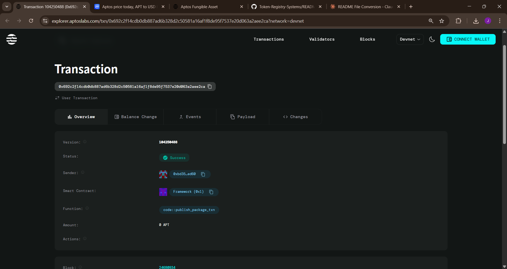

# Token Registry System

<div align="center">
  <h3>🛡️ Decentralized Token Registry for the Aptos Blockchain</h3>
  <p>A comprehensive smart contract solution for tracking, registering, and verifying token contracts</p>
  
  [](https://aptoslabs.com/)
  [](https://move-language.github.io/)
  [](https://opensource.org/licenses/MIT)
</div>

## 📖 Overview

The Token Registry System is a decentralized smart contract built on the Aptos blockchain that provides a comprehensive solution for tracking, registering, and verifying token contracts. This system serves as a central repository where token creators can register their contracts, providing transparency and legitimacy to the token ecosystem.

The smart contract enables users to register their token contracts with essential metadata including name, symbol, contract address, and ownership information. Each registered token is timestamped and includes a verification status, creating a reliable database of legitimate tokens within the ecosystem.

## 🎯 Vision

Our vision is to create a trusted, decentralized registry that enhances the security and transparency of the token ecosystem on Aptos. By providing a standardized way to register and verify token contracts, we aim to:

- **Reduce Token Fraud**: Help users identify legitimate tokens and avoid scam projects
- **Increase Transparency**: Provide public access to token information and verification status
- **Establish Trust**: Create a reputation system for token creators and projects
- **Facilitate Discovery**: Enable easy discovery of new and verified token projects
- **Support Ecosystem Growth**: Provide infrastructure that supports the healthy growth of the Aptos DeFi ecosystem

## ✨ Key Features

### 🔐 Secure Registration System
- Admin-controlled registry initialization
- Duplicate registration prevention
- Ownership verification and tracking

### 📊 Comprehensive Token Metadata
- Token name and symbol storage
- Contract address mapping
- Owner/creator identification
- Registration timestamp tracking

### ✅ Verification Framework
- Built-in verification status for each token
- Admin-controlled verification process
- Trust scoring foundation for future enhancements

### 🛡️ Security Features
- Proper error handling with custom error codes
- Access control mechanisms
- Resource management with Move's ownership model

### 🚀 Scalable Architecture
- Efficient vector-based token storage
- Modular design for easy extensions
- Gas-optimized operations

## 🗺️ Roadmap

### Phase 1: Enhanced Verification
- **Multi-level Verification**: Implement different verification tiers (basic, premium, audited)
- **Verification Criteria**: Establish clear standards for token verification
- **Community Voting**: Enable community-driven verification processes

### Phase 2: Advanced Features
- **Token Analytics**: Add support for tracking token metrics and statistics
- **Integration APIs**: Develop APIs for easy integration with wallets and DeFi platforms
- **Reputation System**: Implement scoring system for token creators based on project success

### Phase 3: Ecosystem Integration
- **Cross-chain Registry**: Expand to support multi-chain token registration
- **DeFi Integration**: Direct integration with major DeFi protocols on Aptos
- **Governance Token**: Launch governance token for decentralized registry management

### Phase 4: Advanced Tools
- **Risk Assessment**: AI-powered risk analysis for registered tokens
- **Compliance Tools**: KYC/AML integration for institutional users
- **Insurance Integration**: Partner with insurance protocols for token protection

### Phase 5: Ecosystem Services
- **Token Launchpad**: Integrated token launching platform
- **Marketing Tools**: Built-in promotion and discovery features
- **Analytics Dashboard**: Comprehensive analytics for token performance

## 🚀 Getting Started

### Prerequisites

Before you begin, ensure you have the following installed:

- [Aptos CLI](https://aptos.dev/cli-tools/aptos-cli-tool/install-aptos-cli)
- Move compiler setup
- Aptos wallet configured

### Installation & Deployment

```bash
# Clone the repository
git clone <repository-url>

# Navigate to project directory
cd token-registry-system

# Compile the contract
aptos move compile

# Deploy the contract
aptos move deploy
```

## 💡 Usage Examples

### Initialize the Registry (Admin Only)
```bash
aptos move run --function-id 'MyModule::TokenRegistry::initialize_registry'
```

### Register a New Token
```bash
aptos move run --function-id 'MyModule::TokenRegistry::register_token' \
  --args string:"MyToken" string:"MTK" address:"0x123..."
```

## 📋 Contract Details

*This section will be updated with specific deployment details, addresses, and technical specifications once deployed.*

## 🤝 Contributing

We welcome contributions to improve the Token Registry System! Here's how you can help:

1. Fork the repository
2. Create your feature branch (`git checkout -b feature/AmazingFeature`)
3. Commit your changes (`git commit -m 'Add some AmazingFeature'`)
4. Push to the branch (`git push origin feature/AmazingFeature`)
5. Open a Pull Request

Please feel free to submit issues, feature requests, or pull requests.

## 📝 License

This project is licensed under the MIT License - see the [LICENSE](LICENSE) file for details.

## Contract Details

<a href="https://explorer.aptoslabs.com/txn/0x692c2f14cdb0db887ad6b328d2c50581a16af1f8de95f7537e20d063a2aee2ca?network=devnet">0x692c2f14cdb0db887ad6b328d2c50581a16af1f8de95f7537e20d063a2aee2ca</a>



## 🏗️ Built With

- [Aptos](https://aptoslabs.com/) - L1 Blockchain
- [Move](https://move-language.github.io/) - Smart Contract Language

---

<div align="center">
  <p>Built with ❤️ for the Aptos ecosystem</p>
</div>
